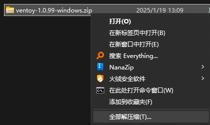
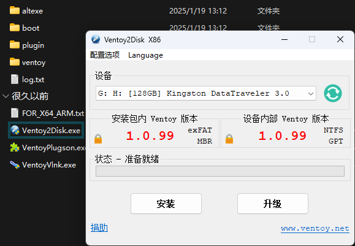
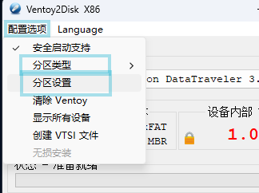
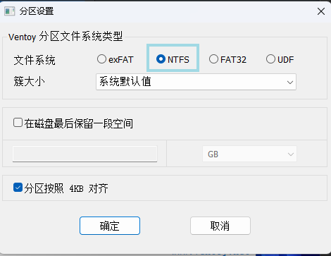

- Ventoy可以让一个U盘能够安装多个镜像，在启动时可选择引导镜像。一般用于多系统安装盘

## 下载并解压Ventoy

ventoy官方网站带宽较小，建议前往镜像站下载

- [南京大学镜像站-Ventoy下载](https://mirrors.nju.edu.cn/github-release/ventoy/Ventoy/Ventoy%201.0.99%20release/)

- 根据系统下载

## 安装至移动硬盘/U盘

- 双击其中的"Ventoy2Disk.exe"启动

- 打开配置选项进行配置

- 若非不支持UEFI引导的远古设备，分区类型都建议使用GPT

- 建议使用NTFS

- 完成以后查看设备选择是否正确，点击安装

---
至此，Ventoy安装完成，只需要将要引导的镜像(iso)文件放入已安装Ventoy的设备，修改引导设备为此设备，即可引导任意镜像

---
